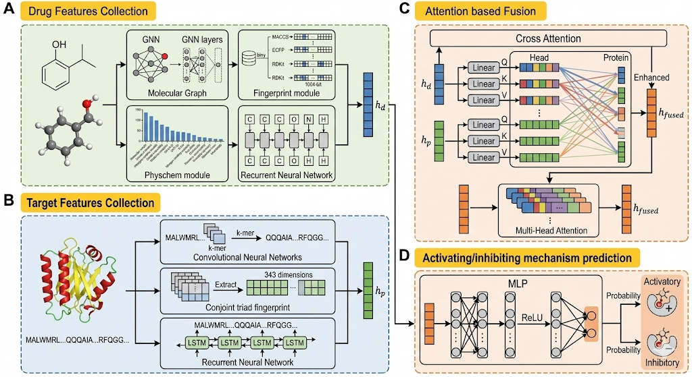

# CrossDTI
## Overview


## Dependencies
The package depends on the Python==3.10.18:
```
dgl==1.1.2+cu118
dgllife==0.3.2
numpy==1.23.5
pandas==2.3.2
pytorch==2.1.0+cu118
torch-geometric== 2.6.1
rakit==2025.9.1
```
## Datasets
activating/inhibiting mechanisms
The dataset employed in this study was initially sourced from the article:"DrugAI: a multi-view deep learning model for predicting drug–target
activating/inhibiting mechanisms"<br>
The statistics of dataset are shown below:

| Drug-target actions                         | No.of Samples           | Ratio |
|---------------------------------------------|-------------------------|----------------|
| activatory                                  | 3322                    | 29.58%         |
| inhibitory                                  | 7907                    | 70.42%         |


The datasets are stored in ```./data/dataset.csv``` and contains 11229 compounds'SMILES,sequences and labels.<br>
The file ```./data/index.txt``` contains the index numbers of train, validation, and test sets.<br>
## Running the Experiment
To run our model based on the default conditions:
```bash
$ python main.py
```
The model trained will be stored in ```./output```

## Trained models

The models we trained are stored in https://zenodo.org/records/17760553

## Model and Dataset

Please find the model and dataset at Zenodo link: https://zenodo.org/records/17760553


  

